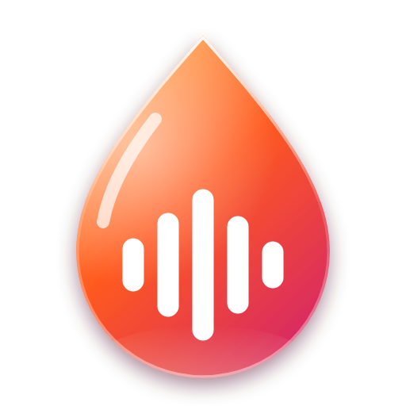

<div align="center">



# Cloudglass

**A privacy-first, liquid-glass desktop app for SoundCloud on Windows.**

</div>

> [!IMPORTANT]
> **Cloudglass is an unofficial, independent project. It is not affiliated with, endorsed by, sponsored by, or approved by SoundCloud.**
> "SoundCloud" is a trademark of its owner and is used here only to say what the app connects to.
> Cloudglass does not use SoundCloud's logo. See the [full disclaimer](#disclaimer).

Cloudglass shows the official soundcloud.com website in its own window. It adds a translucent "liquid glass" design and a set of privacy and security protections you don't get in a normal browser tab.

---

## Privacy and security at a glance

| | |
|---|---|
| 🚫 **No telemetry, ever** | No analytics, crash reports, usage statistics or update checks. Cloudglass has no server and makes no network requests of its own. |
| 🛡️ **Tracker blocking, on by default** | Blocks 85 third-party tracking, analytics, advertising and ID-sync domains ([`trackers.js`](trackers.js)). In our test, a single logged-out SoundCloud session contacted **40+ third-party tracking domains** (TikTok, Google Analytics, Facebook, Reddit, Criteo, Taboola, Amazon Ads, Quantcast, comScore and more). With Cloudglass, none of those requests got through. |
| ✋ **Global Privacy Control** | Every request carries the `Sec-GPC: 1` signal, and pages see `navigator.globalPrivacyControl = true`. This is a legally recognised "do not sell or share my data" request in several jurisdictions. |
| 🔑 **Your password stays out of Cloudglass** | You sign in on SoundCloud's, Google's, Apple's or Facebook's own pages. Cloudglass's scripts never run on those pages and never read form fields. |
| 💾 **Your data stays on your PC** | Only window size, preferences and SoundCloud's own cookies are stored, all locally. Cookies are encrypted at rest. One click erases everything. |
| 🔒 **Hardened Electron** | Sandboxed, context-isolated renderers. No Node.js in web content. Strict navigation and pop-up allowlists. Every device and sensor permission is denied. Strict CSP. Validated IPC. Security fuses. No DevTools in release builds. |
| ✅ **Verifiable builds** | Releases are built by GitHub Actions from the tagged source. Each one includes SHA-256 checksums, plus signed build provenance whenever the repository is public. |

Details: **[PRIVACY.md](PRIVACY.md)** · **[SECURITY.md](SECURITY.md)**

---

## Features

- **Liquid-glass design:** a frosted Acrylic, Mica or solid window, and floating glass panels that bend the content behind them. A soft glow follows the artwork of the current track.
- **SoundCloud, restyled:** the search bar, account buttons and player bar float as glass capsules, and the page itself is translucent.
- **App-style navigation:** a sidebar with Home, Feed, Library, Likes, Playlists, Albums, Stations, Following and History. Switching pages never interrupts playback.
- **Windows integration:**
  - media keys and the Windows media overlay
  - play / pause / next / previous buttons in the taskbar thumbnail
  - a tray icon with playback controls
  - optional "keep playing when closed"
- **Full screen (F11)** keeps the whole app, with a one-click exit button.
- Adapts to narrow windows (icon-only sidebar, zoom-to-fit), remembers your window and last page, and allows a single instance.
- Shortcuts: <kbd>Ctrl</kbd>+<kbd>K</kbd> search · <kbd>Alt</kbd>+<kbd>←</kbd>/<kbd>→</kbd> back/forward · <kbd>F5</kbd> reload · <kbd>Ctrl</kbd>+<kbd>+</kbd>/<kbd>-</kbd>/<kbd>0</kbd> zoom · <kbd>F11</kbd> full screen

## Install

1. Download `Cloudglass-Setup-<version>.exe` (installer) or `Cloudglass-Portable-<version>.exe` (no install) from **[Releases](../../releases)**.
2. [Verify the download](#verify-your-download). This is recommended.
3. Run it. The builds are not code-signed (certificates cost money), so Windows SmartScreen will warn you the first time. Choose **More info → Run anyway** only after verifying the checksum.

The setup wizard walks you through **Welcome → License agreement → Setup type → Install → Finish**:

- **Express (recommended):** installs to your user profile (`%LOCALAPPDATA%\Programs\Cloudglass`) with Start menu and desktop shortcuts.
- **Custom:** choose the install folder and which shortcuts to create.

Cloudglass always installs for your Windows account only, so no administrator rights are needed. Installing a new version over an old one keeps your settings and sign-in.

To uninstall, use **Settings → Apps → Installed apps → Cloudglass**. The uninstaller asks whether to also remove your Cloudglass data (settings and SoundCloud sign-in). The default is to keep it.

### Verify your download

Every release includes `SHA256SUMS.txt`. In PowerShell:

```powershell
Get-FileHash .\Cloudglass-Setup-1.1.0.exe -Algorithm SHA256
```

The hash must match the line in `SHA256SUMS.txt`. When the repository is public, releases also carry a signed build-provenance attestation. It proves GitHub Actions built the file from this repository's source, and you can check it with the [GitHub CLI](https://cli.github.com):

```powershell
gh attestation verify .\Cloudglass-Setup-1.1.0.exe --repo Fluxie02/cloudglass
```

## Build from source

Requires [Node.js](https://nodejs.org) 20 or newer.

```powershell
git clone https://github.com/Fluxie02/cloudglass.git
cd cloudglass
npm ci
npm start          # run the app
npm run dist       # build dist\Cloudglass-Setup-*.exe and dist\Cloudglass-Portable-*.exe
```

If `npm start` reports that Electron failed to install, run `npx install-electron` once. Newer npm versions skip install scripts by default.

Keep the project in a short folder path, such as `C:\dev\cloudglass`. Electron and the build tools fail in very deeply nested folders.

### Project layout

| File | What it does |
|---|---|
| [`main.js`](main.js) | Window, tray, taskbar buttons, and the security policy: navigation and permissions allowlists, tracker blocking, Global Privacy Control, IPC validation |
| [`trackers.js`](trackers.js) | The tracker blocklist, with sources |
| [`webview-preload.js`](webview-preload.js) | Runs on soundcloud.com only: glass refraction, now-playing info, player commands |
| [`preload.js`](preload.js) | The narrow bridge between the shell UI and the main process |
| [`src/`](src) | The glass shell UI and [`src/soundcloud.css`](src/soundcloud.css), the restyle for soundcloud.com |
| [`scripts/make-icons.js`](scripts/make-icons.js) | Renders the icons in `build/` |

## Known limitations

- Tracks that need DRM (some SoundCloud Go+ content) may not play, because Electron doesn't ship Chrome's Widevine module.
- If Google refuses "Continue with Google" in an embedded app, sign in with email, Apple or Facebook.
- SoundCloud may ask you to sign in before playing. This happens with or without tracker blocking.
- There are no automatic updates, by design (no update server to phone home to). Watch this repository's releases to get new versions.
- A SoundCloud redesign can break parts of the glass restyle. When that happens, those parts fall back to SoundCloud's normal look.

## Disclaimer

Cloudglass is an independent, community-made, open-source project. It is **not affiliated with, associated with, authorized by, endorsed by, sponsored by, or in any way officially connected with SoundCloud** or any of its subsidiaries or affiliates. "SoundCloud" and related names, marks and logos are trademarks of their respective owner. They are used here only to identify the service the app connects to; the SoundCloud logo is not used.

All content, accounts and services shown in Cloudglass are provided by SoundCloud through its own website, under [SoundCloud's Terms of Use](https://soundcloud.com/terms-of-use) and [Privacy Policy](https://soundcloud.com/pages/privacy), which still apply when you use this app. Cloudglass does **not** download, rip or redistribute audio. It does **not** bypass subscriptions, paywalls, geo-restrictions or DRM. The tracker blocker stops third-party tracking and ad-tech scripts, which can also hide some third-party display ads. You can switch it off at any time.

Cloudglass is provided "as is", without warranty of any kind. See [LICENSE](LICENSE).

## License

[MIT](LICENSE)
